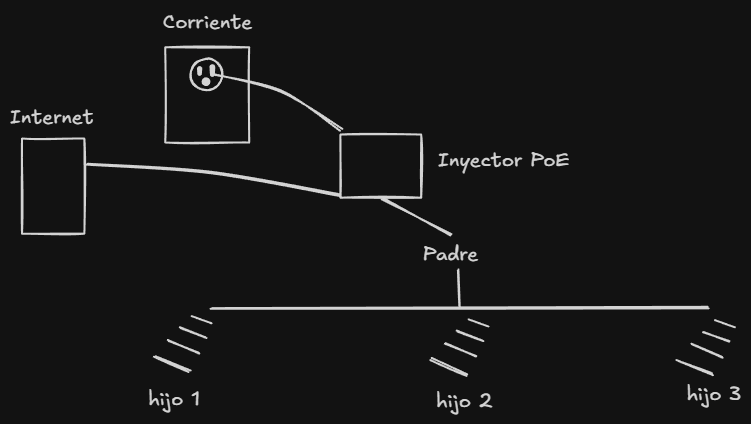

# Práctica 12 (REI) - 7/4/2026

Implementar la configuración de red en UniFi, detallada en el documento en plataforma:

* `Caso de estudio practico a implementar-07042026.pdf`

## Diagrama

## Detalles

* Al crear la red WiFi, dejarla como **Standard** en lugar de **Hotspot**.
* Una vez adoptados los **hijos**, verificar en la sección **Topology**.