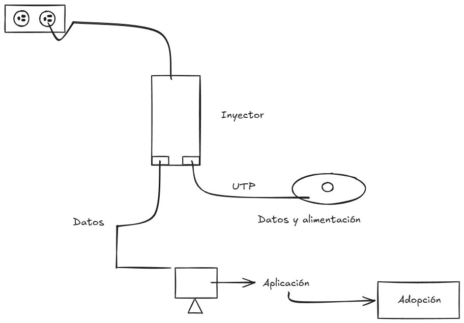

# Práctica 9 (REI) - 18/3/2026

Explicación de la práctica y conexión del **UBIQUITI**:



>Diagrama hecho en [Excalidraw](https://excalidraw.com/)

## Configuraciones

Es necesario crear una cuenta en [Ubiquiti](https://www.ui.com/) para poder acceder a la plataforma de gestión de dispositivos **UniFi Network Controller**.

Las computadoras del laboratorio de redes tienen contraseñas de administrador, por lo que tuvimos que instalar ****UniFi Network Controller**
en nuestra computadora personal o en mi caso en máquina virtual para poder configurar el **UBIQUITI**.

**Configuración de mi máquina virtual en VirtualBox**:
* Sistema operativo: Debian 13
* RAM: 4GB
* Almacenamiento: 80GB
* Procesador: 3 núcleos
* Red: Adaptador puente, *IP estática* (para que la máquina virtual tenga acceso a la red local y pueda comunicarse con el UBIQUITI)
* Enotrno gráfico: XFCE (ligero y fácil de usar)
* Particiones:
  * `swap`: 2GB
  * `/boot`: 2GB, ext4
  * `/ (raíz)`: 35GB, btrfs
  * `/home`: (el resto aquí), xfs

## Instalación de UniFi Network Controller en Debian 13

Actualizar el sistema:

```bash
su -
apt update && apt upgrade -y
```

Instalar dependencias necesarias:

```bash
apt install -y wget curl ca-certificates
```

Instalar **UniFi Network Controller** desde script de instalación:

```bash
curl -sO https://get.glennr.nl/unifi/install/install_latest/unifi-latest.sh && bash unifi-latest.sh
```

>Esto instala Java, MongoDB y el controlador UniFi automáticamente

Una vez instalado, el controlador se ejecuta como un servicio en segundo plano. Podemos acceder a la interfaz web de **UniFi Network Controller**
desde un navegador ingresando la dirección IP de la máquina virtual seguida del puerto 8443, por ejemplo: `https://192.168.1.100:8443`

## Documentos complementarios

En la carpeta `Practicas dispositivos UBIQUITI-20260328/`:

* [P-Configuración de un Access Point para Mesh en Exterior](../Practicas%20dispositivos%20UBIQUITI-20260328/P-Configuración%20de%20un%20Access%20Point%20para%20Mesh%20en%20Exterior.docx)
* [P-Configuración y Administración de un Access Point Ubiquiti U6 Mesh](../Practicas%20dispositivos%20UBIQUITI-20260328/P-Configuración%20y%20Administración%20de%20un%20Access%20Point%20Ubiquiti%20U6%20Mesh.docx)

Resolución de preguntas de los documentos complementarios:

* [P-Configuración de un Access Point para Mesh en Exterior](./ap-mesh-en-exterior.md)
* [P-Configuración y Administración de un Access Point Ubiquiti U6 Mesh](./ap-ubiquiti-u6-mesh.md)